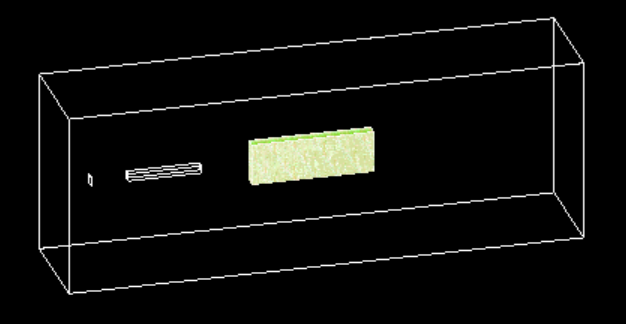
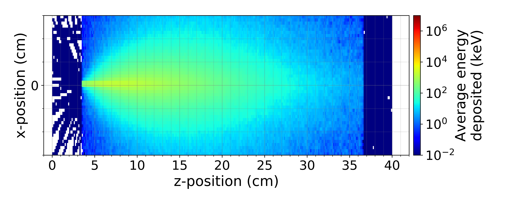

# CsI stack array - GEANT4 simulation
GEANT4 code simulates a CsI array and the energy deposited in its pixels by a primary particle and its secondaries.

The geometry is based on the CsI array used in experiments at the Centre for Advanced Laser Applications (CALA). The purpose of this CsI array is to diagnose the spectrum of gamma-rays produced in experiments (gamma spectrometer).

**Note:** This code is based on the `GEANT4/examples/extended/electromagnetic/TestEm3` example, which is found together with the GEANT4 installation files.

## Geometry
The geometry is composed of a converter target (tungsten, 500 um thick), a uniform magnetic field (20 cm length, 3.2 Tesla), and the CsI array. 
All the geometries are hard-coded in the file **src/DetectorContruction.cc** and its header file **include/DetectorContruction.hh**.
In case modifications are required, please refer to these both files and customize the geometry for your application.

With this geometry, two simulation scenarios are possible depending on the position of the primary gun:

* Direct hits from the primary particles into the CsI detector. For this mode, the primary gun position should be placed at: ``/gun/position -25 0 0 cm``
* Hits from the bremsstrahlung gamma-photons from the converter after the interaction of the primary charged particle with the converter target. For this mode, the primary gun position should be placed at: ``/gun/position -65 0 0 cm``. 
* Note that, for this configuration, the primaries do not interact with the CsI stack since they are deflected by the magnet before reaching the detector.

In this simulation code, the CsI array is composed of:
* 150 x 30 pixels (material CsI)
* Pixel size: 2 mm x 2 mm x 30 mm
* Interpixel: TiO2 with a thickness of 200 um. 

The energy deposited in the CsI array is scored using scoring meshes available in GEANT4. A Python script is available for post-processing the dump of the scoring.

## Macro file
A macro file with the relevant commands is provided for this GEANT4 application. The name of this macro file is `run01.mac`.

Different configurations as well as the number of primaries for running the simulation can be modified in this file. Please refer to the `run01.mac` file and modify it accordingly to your requirements.

## Running the application
At your system, after having GEANT4 installed and the proper variables from the GEANT4 installation being populated in your bash file and terminal, create a build folder, cmake, and make the code. For example:
    
    mkdir build
    cd build
    cmake -DGEANT4_DIR= $GEANT4_install_dir/lib/Geant4.10.05.p01/ ..
    make -j 4

Now, to run an application, if you have OpenGL installed and configured, you can open the application GUI by typing: `./TestEm3`.

To run the application in batch mode:

    ./TestEm3 run01.mac

This will run the application in batch mode with the number of primaries specified in the macro file **run01.mac**.

## Post-processing the energy deposited
After a successful run, a dump file is created, in this case: eDep.txt, with the energy deposited in each of the bins specified in the scoring mesh.
To plot a 2D integrated view of the deposited energy, run the python script `plot.Edep.py` which is also provided.

    python3 plot_Edep.py

Please modify the script to save and post-process the energy deposited accordingly to your needs.

---

## Credits
**Felipe C. Salgado** (Friedrich-Schiller-Universität Jena, Helmholtz Institute Jena)

## For more information
**GEANT4:** https://geant4-userdoc.web.cern.ch/UsersGuides/InstallationGuide/html/index.html
